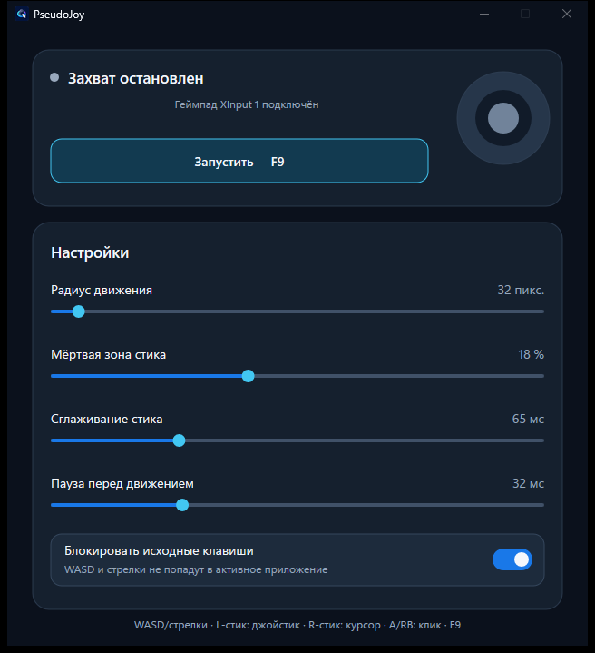

<div align="center">
  
  <h1>PseudoJoy</h1>
  <p>Нативный мост от клавиатуры и физического стика к экранному джойстику.</p>
</div>



PseudoJoy преобразует `WASD`, стрелки или левый стик XInput-геймпада в жест мышью для экранного джойстика. Правый стик работает как обычное управление курсором, а кнопки `A` и `RB` геймпада — как левая кнопка мыши. При первом отклонении игрового направления программа запоминает положение курсора, зажимает левую кнопку и перемещает указатель. Когда ввод возвращается в нейтраль, курсор сначала возвращается в исходную точку, затем кнопка отпускается.

Приложение написано на C++ без сторонних библиотек времени выполнения: Win32, Direct2D, DirectWrite, DWM, XInput и `SendInput`.

## Возможности

- глобальный ввод с `WASD` и стрелок даже при неактивном окне PseudoJoy;
- глобальный запуск и остановка по `F9`;
- левый стик любого доступного XInput-геймпада;
- управление обычным курсором правым стиком со скоростью до 900 пикселей в секунду;
- левая кнопка мыши на кнопках `A` и `RB` геймпада, включая удержание для перетаскивания;
- промежуточные аналоговые значения, радиальная мёртвая зона и плавное сглаживание;
- настраиваемая пауза между `Left Down` и первым движением, чтобы игра успела зарегистрировать нажатие;
- корректная смена направления без повторного нажатия мыши;
- пересчёт направления из одного атомарного снимка клавиш и текущего положения стика на каждом тике без зависимости от порядка прошлых нажатий;
- нормализация диагоналей: при радиусе 32 пикселя `WD` даёт примерно `(+23, −23)`, а не `(+32, −32)`;
- поддержка виртуального рабочего стола с несколькими мониторами и отрицательными координатами;
- опциональная блокировка исходных `WASD` и стрелок, чтобы они не попадали в игру;
- сохранение настроек в `HKCU\Software\PseudoJoy`;
- нативный Fluent-интерфейс с единым тёмным фоном клиентской области и системного заголовка;
- компактная многоразмерная иконка: встроенный `.ico` занимает менее 20 КБ.

## Быстрый старт

1. Скачайте `PseudoJoy.exe` со страницы [Releases](https://github.com/USBashka/PseudoJoy/releases) или соберите приложение самостоятельно.
2. Запустите PseudoJoy.
3. Поместите курсор точно в центр экранного джойстика нужного приложения.
4. Нажмите `F9` или кнопку «Запустить».
5. Используйте `WASD`, стрелки либо левый стик для экранного джойстика.
6. Правый стик перемещает обычный курсор, а кнопки `A` и `RB` геймпада выполняют левый клик.
7. Ещё раз нажмите `F9`, чтобы остановить захват. Если кнопка мыши была зажата, PseudoJoy безопасно вернёт курсор и отпустит её.

Якорь выбирается при каждом новом начале движения, поэтому между жестами курсор можно перенести на другой экранный джойстик.

## Настройки

| Параметр | Диапазон | Назначение |
|---|---:|---|
| Радиус движения | 16–300 пикселей | Максимальное расстояние от центра экранного джойстика; по умолчанию 32 пикселя |
| Мёртвая зона стика | 0–45 % | Убирает дрейф физического стика; оставшийся диапазон линейно растягивается до 100 % |
| Сглаживание стика | 0–250 мс | Постоянная времени экспоненциального фильтра; `0` отключает сглаживание |
| Пауза перед движением | 0–120 мс | Время между нажатием мыши в центре джойстика и первым смещением; по умолчанию 32 мс |
| Блокировать исходные клавиши | вкл./выкл. | Не пропускает `WASD` и стрелки в активное приложение, пока захват включён |

Клавиатура и левый стик объединяются как независимые силы действий. Если одновременно задействован экранный джойстик, он временно получает приоритет над правым стиком и кнопками `A`/`RB`, поскольку оба режима используют одну системную мышь.

## Как работает преобразование

Low-level hook обновляет единый битовый снимок физических клавиш. Рабочий поток атомарно читает его целиком на каждом тике, поэтому в расчёт не могут одновременно попасть состояния из разных моментов. Из четырёх независимых действий строится двумерный вектор:

```text
x = (D или →) − (A или ←)
y = (S или ↓) − (W или ↑)
```

Силы направлений от клавиатуры и стика объединяются по тому же принципу, что и действия в `Input.get_vector()`: для каждой стороны берётся максимальная текущая сила, затем вычисляются разности `right − left` и `down − up`. Если длина результата больше единицы, он нормализуется. Поэтому противоположные клавиши взаимно гасятся, отпускание одной из нескольких клавиш немедленно раскрывает оставшееся направление, а диагонали остаются внутри окружности выбранного радиуса.

Для XInput-стика PseudoJoy:

1. преобразует значения `SHORT` в диапазон `[-1; 1]`;
2. применяет мёртвую зону по длине вектора, а не отдельно по осям;
3. линейно перенормирует полезную часть диапазона;
4. сглаживает ненулевое движение экспоненциальным фильтром с частотой опроса около 125 Гц.

Правый стик проходит через ту же радиальную мёртвую зону и фильтр, после чего его отклонение преобразуется в относительную скорость курсора до 900 пикселей в секунду. Нажатие `A` или `RB` отправляет `Left Down`, отпускание обеих кнопок — `Left Up`; поэтому короткое нажатие создаёт обычный клик, а удержание позволяет перетаскивать объекты. Если удерживать обе кнопки, мышь отпустится только после отпускания обеих.

Жизненный цикл одного жеста:

```text
нейтраль → запомнить курсор → Left Down → короткая пауза → абсолютные перемещения
         → возврат в якорь → Left Up → нейтраль
```

Возврат и отпускание отправляются одним пакетом `SendInput`, чтобы приложение не увидело `Left Up` в смещённой точке. Абсолютные координаты рассчитываются по всему виртуальному рабочему столу.

## Системные требования

- Windows 10 x64 версии 1809 или новее;
- XInput-совместимый геймпад нужен только для управления стиком;
- для сборки: Visual Studio 2022/2026 Build Tools с компонентом «Разработка классических приложений на C++», Windows SDK и CMake 3.24+.

## Сборка

Откройте Developer PowerShell for Visual Studio:

```powershell
cmake -S . -B build -A x64
cmake --build build --config Release
ctest --test-dir build -C Release --output-on-failure
```

Готовое приложение находится в `build/Release/PseudoJoy.exe` для генератора Visual Studio или в `build/PseudoJoy.exe` для одноконфигурационного Ninja.

Дымовой тест создаёт небольшое безопасное окно, перемещает в нём курсор и проверяет последовательность `W` → `WD` → `D` → отпускание. Он не требует тестового фреймворка.

## Структура проекта

```text
PseudoJoy/
├── assets/                 # компактные PNG и ICO
├── docs/                   # снимок интерфейса
├── res/                    # Win32-ресурсы и версия файла
├── src/
│   ├── AppWindow.*         # окно, Direct2D UI, DWM-оформление, хук и настройки
│   ├── InputEngine.*       # XInput, векторы и эмуляция мыши
│   └── main.cpp            # DPI, single-instance и цикл сообщений
├── tests/                  # нативный дымовой тест ввода
├── tools/make_icon.py      # сборка PNG-сжатого многоразмерного ICO
└── CMakeLists.txt
```

## Ограничения и безопасность

- PseudoJoy использует левую кнопку мыши. Выход из приложения и остановка захвата всегда пытаются вернуть курсор и отправить `Left Up`.
- Windows запрещает процессу с обычными правами отправлять ввод в приложение, запущенное от администратора. В таком случае запускайте оба процесса с одинаковым уровнем прав.
- Некоторые игры с античитом игнорируют синтетический `SendInput`. PseudoJoy не устанавливает драйвер и не пытается обходить защиту.
- Поддерживаются XInput-контроллеры. Старые DirectInput-устройства без XInput-совместимого режима не обнаруживаются.
- PseudoJoy не может скрыть кнопки `A` и `RB` от игры на уровне XInput: игра может одновременно получить собственное действие и сгенерированный клик мышью.
- Программа не подключается к сети, не внедряет код в другие процессы и не читает их память.

## Лицензия

[MIT](LICENSE) © 2026 USBashka.
